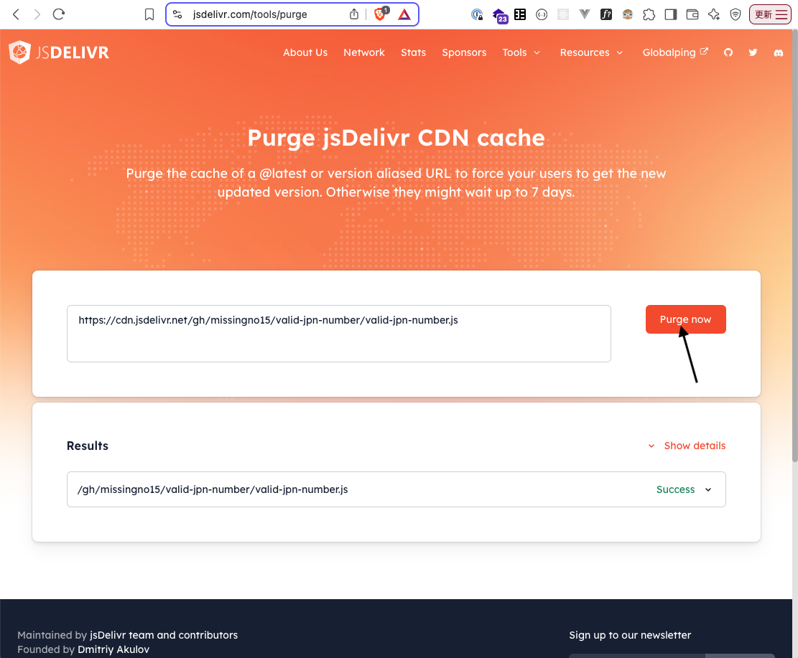

# deliver

GitHub 上に公開したスクリプトやアセットを jsDelivr CDN 経由で配信する方法を解説します。

## 前提条件

- GitHub リポジトリが **公開 (public)** であること
- 配信したいファイル（例: `.js`, `.css`, 画像など）がリポジトリ内に存在すること

## 配信方法

1. **GitHub にコードを公開**
リポジトリを public として公開します。

2. **jsDelivr の URL 形式**
以下の形式でアクセスすると、最新コミットからファイルを配信します。

例） `https://cdn.jsdelivr.net/gh/{GitHubユーザー名}/{リポジトリ名}/{パス/to/ファイル.ext}`

   - `{GitHubユーザー名}`: GitHub のユーザー名（例: `travelbook`）
   - `{リポジトリ名}`: リポジトリ名（例: `deliver`）
   - `{パス/to/ファイル.ext}`: 配信したいファイルの相対パス（例: `valid-jpn-phone-number.js`）

例） `https://cdn.jsdelivr.net/gh/travelbook/deliver/valid-jpn-phone-number.js`

3. **特定のコミットやタグを指定する場合**
コミット SHA やタグ名を指定可能です。
`https://cdn.jsdelivr.net/gh/{ユーザー名}/{リポジトリ名}@{タグ名またはSHA}/{パス/to/ファイル.ext}`

例）`https://cdn.jsdelivr.net/gh/travelbook/my-project@v1.2.3/dist/main.js`

## キャッシュのパージ (Purge)

jsDelivr はグローバル CDN のためキャッシュ反映に数分〜数十分かかる場合があります。
すぐに最新ファイルを配信したい場合は、以下の Purge ツールを利用してください。

- URL: https://www.jsdelivr.com/tools/purge

### 手順

1. 上記ページを開く
2. 「Purge now」フォームに配信 URL を貼り付け
3. **Purge now** ボタンをクリック

